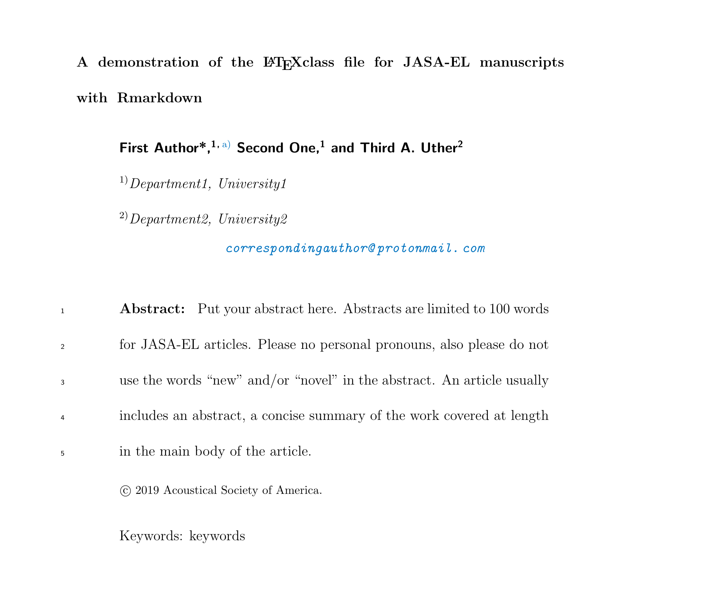

<!-- README.md is generated from README.Rmd. Please edit that file -->

```{r setup, include = FALSE}
knitr::opts_chunk$set(
  collapse = TRUE,
  comment = "#>",
  fig.path = "man/figures/README-",
  out.width = "100%"
)
```
[](https://travis-ci.org/TysonStanley/rjasa)


# rjasa

The goal of rjasa is to allow the use of RMarkdown to produce manuscripts ready for JASA journal submissions. Currently, only the JASA-EL format is available.

## Installation

You can install the released version of `rjasa` from GitHub with:

``` {r, eval=FALSE}
remotes::install_github("tysonstanley/rjasa")
```

## Examples

Using the template, `rjasa` will provide a `.tex` file and a nicely formatted `.pdf` file. This package is still under active development.


