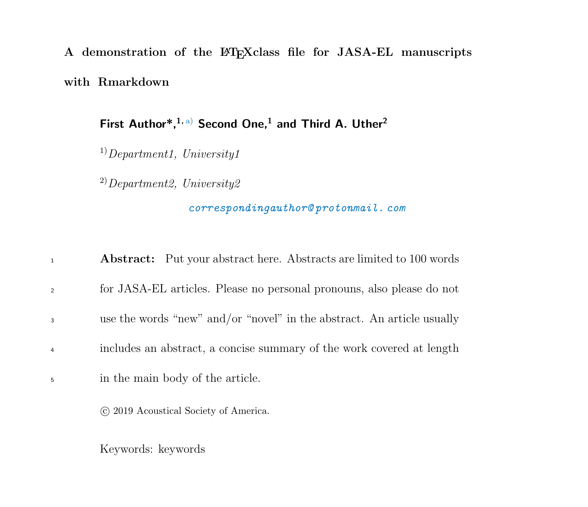

<!-- README.md is generated from README.Rmd. Please edit that file -->

[](https://travis-ci.org/TysonStanley/rjasa)


# rjasa

The goal of rjasa is to allow the use of RMarkdown to produce
manuscripts ready for JASA journal submissions. Both general JASA
formatting and JASA-EL are available.

## Installation

You can install the released version of `rjasa` from GitHub with:

``` r
remotes::install_github("tysonstanley/rjasa")
```

## Examples

Using the template, `rjasa` will provide a `.tex` file and a nicely
formatted `.pdf` file. This package is still under active development.
Usage of the package is essentially identical to the fabulous `rticles`
package.

The title page of the template Rmarkdown for JASA-EL looks like the
following figure:


